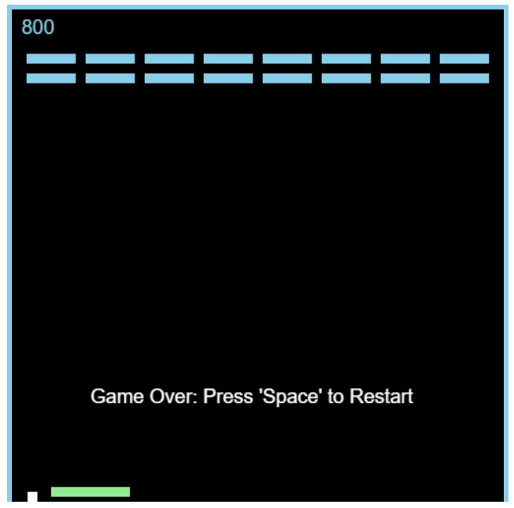
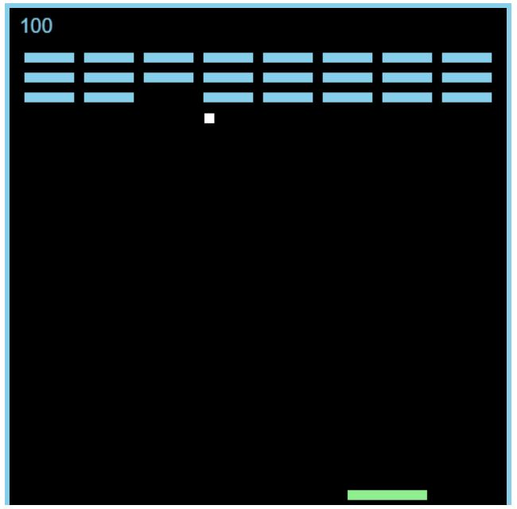

## Breakout Game

- This JavaScript code brings the classic Breakout game to life in your web browser! Challenge yourself by maneuvering the paddle to deflect a bouncing ball and destroy colored blocks. Earn points for each block broken, and aim for the highest score!

### Gameplay:

- Use the left and right arrow keys to move the player paddle at the bottom of the screen.
- The ball bounces around the screen, deflecting off the paddle and the top wall.
- Collide the ball with colored blocks at the top of the screen to break them and score points.
- Be careful not to miss the ball with your paddle, or the game will be over!
- As you progress by clearing blocks, new rows are added, increasing the difficulty.

### Features:

- Smooth ball and paddle movement for an engaging gameplay experience.
- Block collision detection for accurate point scoring.
- Scorekeeping to track your progress and achievements.
- Basic visual effects with colored blocks and a black background.

### Code Breakdown

1. HTML (breakout.html):

- Defines the basic structure of the game screen, including a title (<h1>Breakout</h1>), a score display (<h2>Score: 0</h2>), and a canvas element (<canvas id="board"></canvas>) where the game visuals are rendered.

2. CSS (breakout.css):

- Styles the game screen with a centered text alignment (body { text-align: center; }) and defines styles for the canvas element (#board), including a black background (background-color: black;) and blue borders (border-top, border-left, border-right) to create a visual frame.

3. JavaScript (breakout.js):

- window.onload: Initializes the game when the web page loads.
- Sets the game board dimensions (width and height).
- Initializes the game variables for player, ball, blocks, and score.
- Calls functions to set up the canvas element, create the player paddle, ball, and initial blocks, and add event listeners for keyboard input (arrow keys).

### Game Objects:

- player: Represents the player paddle with properties for its position, dimensions, and movement velocity.
- ball: Represents the bouncing ball with properties for its position, dimensions, and movement velocities in both x and y directions.
- block: Represents an individual colored block with properties for its position, dimensions, and a break property to indicate if the block is broken.
- blockArray: An array that stores all the block objects in the game.
- update: This function is called repeatedly using requestAnimationFrame to continuously update the game state and redraw the game on the canvas.
- Clears the previous canvas content.
- Updates the positions of the player paddle, ball, and checks for collisions.
- Handles ball collisions with the top wall, bottom wall (resulting in game over), player paddle, and blocks (resulting in points and block destruction).
- Updates the block display based on the break property.
- Increments the game score when all blocks in a row are broken, potentially adding new block rows.
- Renders the player paddle, ball, and blocks on the canvas.
- Collision Detection Functions (topCollision, bottomCollision, leftCollision, rightCollision):
- These functions determine if a collision has occurred between the ball and another object (player paddle or block) based on their positions and dimensions.

### Other Helper Functions:

- outOfBounds: Checks if the player paddle is about to move outside the allowed screen area.
- movePlayer: Handles left and right arrow key presses to move the player paddle.
- createBlocks: Generates a new layout of colored blocks at the top of the screen.
- resetGame: Resets the game state to

